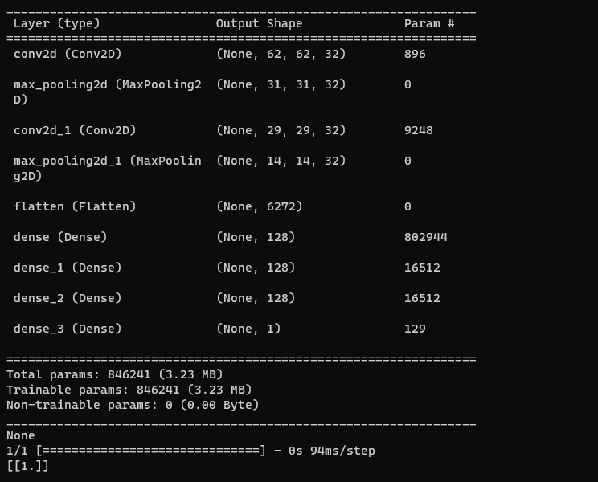

# Cancer Detection Image Classification

### Model Architecture:

### Overview:
A deep learning project that classifies medical images of patients as cancerous or non-cancerous using a Convolutional Neural Network (CNN) built with TensorFlow and Keras. The model employs convolutional and pooling layers combined with Artificial Neural Networks (ANN) to achieve high accuracy. To prevent overfitting and enhance model generalization, the program incorporates automatic image augmentation.

### Features
- Image Classification: Accurately classifies images as cancerous or non-cancerous.
- Deep CNN Architecture: Utilizes convolutional, pooling layers, and ANN for robust feature extraction and classification.
- Image Augmentation: Automatically applies augmentation techniques to reduce overfitting and improve model robustness.
- TensorFlow & Keras: Built using powerful deep learning frameworks for efficient model development and training.

### Technologies Used
- Programming Language: Python 3.x
- Deep Learning Frameworks: TensorFlow, Keras

### Model Architecture
The CNN model architecture consists of:
- Convolutional Layers: Extracts spatial features from input images.
- Pooling Layers: Reduces dimensionality and controls overfitting.
- Fully Connected ANN Layers: Learns complex patterns and performs classification.
- Output Layer: Outputs the probability of the image being cancerous or non-cancerous.

### Results
- Validation Accuracy: 90%